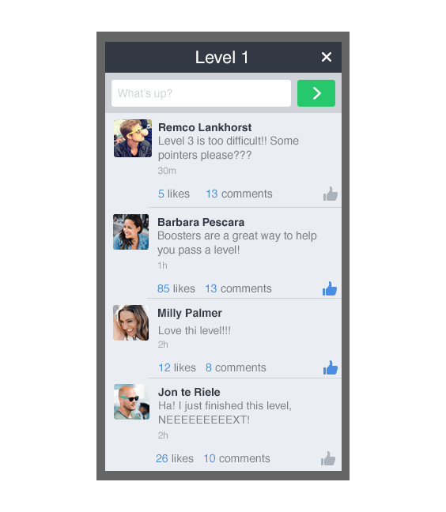
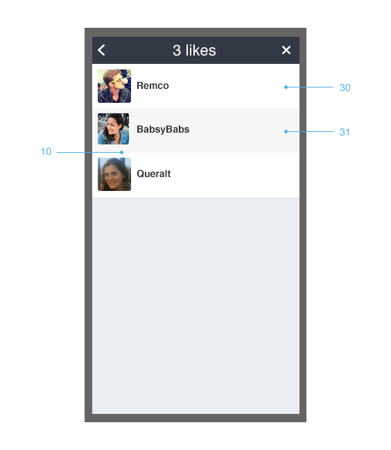
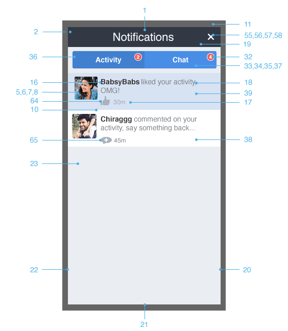
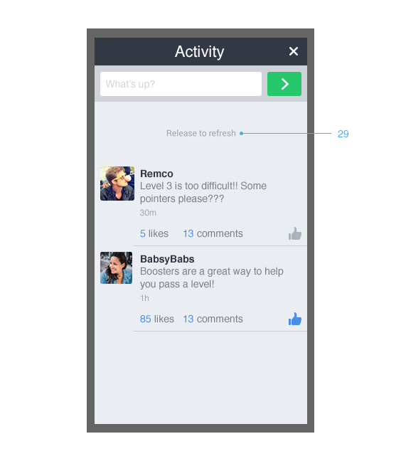
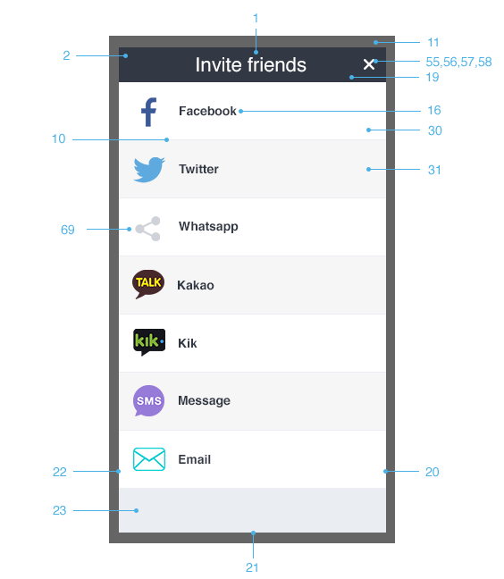
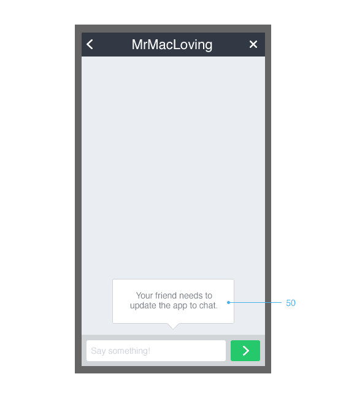
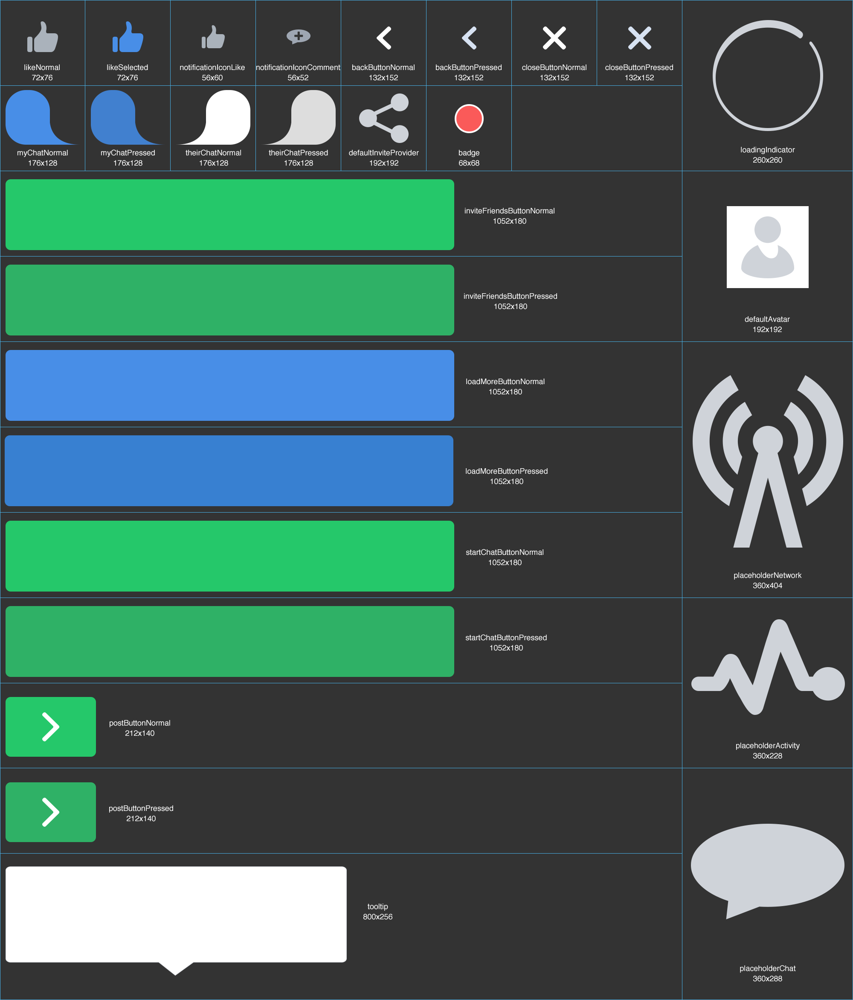
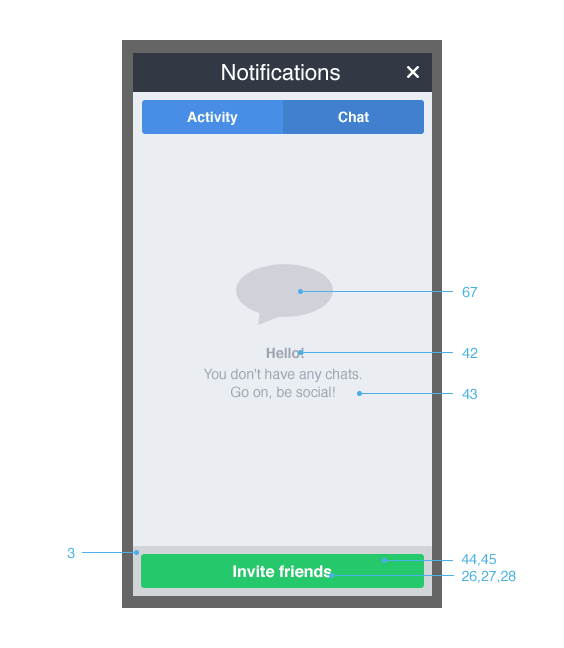

# Getting Started


Build and manage the community within your games with **GetSocial** .

GetSocial provides the whole social layer stack that powers **engagement**, **retention**, **acquisition** and **revenue tools** .


**Features Include:**

* Fully customisable UI
* Player-to-player chat
* Developer-to-player communication
* Segmented and Global Activity Feeds
* Screenshot capture and sharing
* Community Management
* Player Feedback and support
* Smart invites and tracking
* Socially endorsed promotions for in-app purchases
* Socially relevant cross-promotion tools
* Localised to 12 languages
* In-app Notification Center
* Socially triggered push notifications
* And more…


For more information on GetSocial, visit our [website](http://www.getsocial.im/) or [contact us](mailto:info@getsocial.im).


To manage the integration of the GetSocial SDK, [login to your developer account](https://developers.getsocial.im).


# Let’s get the integration started


* [Adding the SDK to your game](#adding-the-sdk-to-your-game)
  * [Initialization](#initialization)
  * [Localization](#localization)
* [Activities](#activities)
* [Chat](#chat)
  * [Chat rooms](#chat-rooms)
* [Smart Invites](#smart-invites)
* [Notification Center](#notification-center)
* [Push Notifications](#push-notifications)
* [Integration with facebook](#integration-with-facebook)
  * [User Authentication](#user-authentication)
  * [Smart Invites](#smart-invites)
* [Customizing the appearance](#customizing-the-appearance)
  * [Getting the current configuration](#getting-the-current-configuration)
  * [Specifying window width and height](#specifying-window-width-and-height)
  * [Scaling the content](#scaling-the-content)
  * [Specifying the animation](#specifying-the-animation)
  * [Specifying colors](#specifying-colors)
  * [Specifying images](#specifying-images)
  * [Specifying dimensions](#specifying-dimensions)
  * [Specifying text styles](#specifying-text-styles)
  * [Using custom fonts](#using-custom-fonts)
  * [UI Reference Table](#ui-reference-table)


# Adding the SDK to your game


Download the GetSocial SDK from [here](https://github.com/getsocial-im/getsocial-ios-sdk/archive/master.zip). Now, let's add it to your project.


Open your game on **Xcode** and drag and drop the GetSocial.embeddedframework into your project.


You need to ensure that you include in the "Link Binary with Libraries" the following iOS Native Frameworks:


* Accelerate.framework
* AudioToolbox.framework
* AVFoundation.framework
* CoreLocation.framework
* CoreMedia.framework
* CoreTelephony.framework
* libresolv.dylib
* libsqlite3.dylib
* libxml2.dylib
* libz.dylib
* MessageUI.framework
* MobileCoreServices.framework
* Social.framework
* SystemConfiguration.framework


And finally just add this flag “-lstdc++” to your project's “Other Linker Flags” inside Build Settings section.


## Initialization


In just one step you will be able to have your game GetSocial-ready. Once you have the basics in place, you can easily add other GetSocial features into your game.


Before using any other functionality, you should first authenticate your game:


The best place to start would be in your AppDelegate.m.


```objectivec
#import <GetSocial/GetSocial.h>
```


And call the `authenticateGame:` inside `application:didFinishLaunchingWithOptions:`


```objectivec
[[GetSocial sharedInstance] authenticateGame:@"AppKey" success:^{
        // game authenticated
} failure:^(NSError *error) {
        // game not authenticated
}];
```


Your App Key can be found in the GetSocial Developer Portal or obtained from your GetSocial Developers Relations Manager.


You can also register an observer to be notified every time one of our views is opened or closed.


```objectivec
[[NSNotificationCenter defaultCenter] addObserverForName:GetSocialViewOpenNotification object:nil queue:nil usingBlock:^(NSNotification *note) {
    	//code to handle the opening of a GetSocial View, maybe pause the game if needed.
    }
}];

[[NSNotificationCenter defaultCenter] addObserverForName:GetSocialViewCloseNotification object:nil queue:nil usingBlock:^(NSNotification *note) {
    	//code to handle the closing of a GetSocial View, maybe resume the game if needed.
    }
}];
```


## Localization


The GetSocial SDK supports multiple languages. By default the device language is used, to change it you need to call the setLanguage method providing one of the following codes. 

We currently support the following languages:


| <sub>Language   </sub>| <sub>ISO Code   </sub> |
|------------|-------------|
| <sub>Danish     </sub>| <sub>da         </sub> |
| <sub>Dutch      </sub>| <sub>nl         </sub> |
| <sub>English    </sub>| <sub>en         </sub> |
| <sub>French     </sub>| <sub>fr         </sub> |
| <sub>German     </sub>| <sub>de         </sub> |
| <sub>Italian    </sub>| <sub>it         </sub> |
| <sub>Norwegian  </sub>| <sub>nb         </sub> |
| <sub>Portuguese </sub>| <sub>pt         </sub> |
| <sub>Russian    </sub>| <sub>ru         </sub> |
| <sub>Spanish    </sub>| <sub>es         </sub> |
| <sub>Swedish    </sub>| <sub>sv         </sub> |
| <sub>Turkish    </sub>| <sub>tr         </sub> |


```objectivec
[[GetSocial sharedInstance] setLanguage:@"en"];
```


Please note that you can always call this method, but the UI needs to be reloaded to reflect the changes.


# Activities


Showing activities for your game is quite easy


```objectivec
[[GetSocial sharedInstance] open:GetSocialViewTypeActivities];

```


You can also pass a NSDictionary as second argument to specify additional properties. For instance, if you want to show a custom title, you can provide it as follow


```objectivec
[[GetSocial sharedInstance] open:GetSocialViewTypeActivities withProperties:@{kGetSocialTitle:@"Level 1"}];

```


Do you need more control on what to show on the Activity Feed or maybe have different Activity feeds per level, per clan or a custom attribute?


[Contact us](mailto:info@getsocial.im) and we will show you how to do it easily.



# Chat


Chat is integrated into your game the moment you integrate the GetSocial SDK. Every time a user taps on another user’s avatar, a chat conversation is started between the two


You can link to the chat views that enable your users to view their active conversations and also start new conversations with their friends:


```objectivec
[[GetSocial sharedInstance] open:GetSocialViewTypeChat];

```


You can also directly open a chat conversation from user’s avatar within the game using their User ID on supported Social Providers.


```objectivec
[[GetSocial sharedInstance] open:GetSocialViewTypeActivities withProperties:@{kGetSocialProvider:@"facebook", kGetSocialUserID:@"0123456789"}];

```


## Chat rooms

Chat rooms are magical constructs where kind spirits from your community come together to chat about life, the universe, and everything. As a developer you are in full control of which users are able to participate in these rooms, and the number of rooms is unlimited.


```objectivec

NSMutableDictionary *properties = [[NSMutableDictionary alloc] init];
[properties setObject:@"roomName" forKey:kGetSocialRoomName];
[properties setObject:@"Room Name" forKey:kGetSocialTitle];
    
[[GetSocial sharedInstance] open:GetSocialViewTypeChat withProperties:properties];

```


# Smart Invites


Using Smart Invites users can easily invite their friends to join and play the game. To open the smart invite view you should call:


```objectivec
[[GetSocial sharedInstance] open:GetSocialViewTypeSmartInvite];

```


You will see several options to invite friends, depending on what applications you have currently installed on your and which providers you enabled in the [GetSocial Developer Portal](https://developers.getsocial.im).


# Notification Center


Activity feed and Chat features are incomplete without having the Notification Center that provides in-app notifications to users when someone likes or comments on their activities or when they receive chat messages. 


```objectivec
[[GetSocial sharedInstance] open:GetSocialViewTypeNotifications];

```


It is highly recommended that you link this to a UI element with a notifications count badge. The SDK provides a block that allows getting count of the unread chats and activity notifications.


```objectivec
[[GetSocial sharedInstance] setOnNotificationsChangeHandler:^(NSInteger unreadNotificationsCount, NSInteger unreadConversationsCount) {
   //code to handle changes on Notifications/Conversations counts 
}];
```


# Push Notifications


You first need to generate the right Push Notification Certificates on Apple Developer Portal and then upload them in the [GetSocial Developer Portal](https://developers.getsocial.im). You upload the Development or Production Certificate and choose which one to use.


To start sending Push Notifications to the user's device, GetSocial will ask for permissions to users the first time they log in. We ask for the Alert and Sound permissions.


You don't need to add any code to your game as GetSocial handles everything internally.


# User Authentication


GetSocial SDK needs to integrate with the Game login to enable chat, posting activities, comments, liking activities and install attribution. 


Whenever a user performs an action that requires login, the SDK calls the login request handler which allows the game to show it’s own login UI.


```objectivec
[[GetSocial sharedInstance] setOnLoginRequestHandler: ^void() {
    // Show Game login UI
}];
```


# Integration with Facebook


The GetSocial SDK can easily interact with the Facebook social features using one of the latest versions of the Facebook SDK.


Make sure you follow the [Facebook SDK integration for iOS](https://developers.facebook.com/docs/ios/getting-started).


## User Authentication


Whenever a user performs an action that requires login, the SDK calls the login request handler which allows the game to show the FB Login UI. You could use FB default UI or implement your own.


```objectivec
[[GetSocial sharedInstance] setOnLoginRequestHandler:^{
        [self loginWithFacebook];
}];


- (void)loginWithFacebook
{
	//opens a FB session with required permissions and calls GetSocialFacebookUtils on complete to 
    //sync the state also with the GetSocial SDK

    [FBSession openActiveSessionWithReadPermissions:@["public_profile", "user_friends"]

                                       allowLoginUI:YES

                                  completionHandler:^(FBSession *session, FBSessionState status, NSError *error) {

                                        [[GetSocialFacebookUtils sharedInstance] updateSessionState];

                                  }];

}
```


If you are using the FBLoginView, you need to also implement the FBLoginViewDelegate to get the state changes and sync the GetSocial.


```objectivec
- (void)loginViewShowingLoggedInUser:(FBLoginView *)loginView
{
    [[GetSocialFacebookUtils sharedInstance] updateSessionState];
}

- (void)loginViewShowingLoggedOutUser:(FBLoginView *)loginView
{
   [[GetSocialFacebookUtils sharedInstance] updateSessionState];
}

- (void)loginView:(FBLoginView *)loginView handleError:(NSError *)error
{
    [[GetSocialFacebookUtils sharedInstance] updateSessionState];
}
```


If you are not using the FBLoginView, make sure you call `[[GetSocialFacebookUtils sharedInstance] updateSessionState];` whenever you receive an update of the state of the FB active session.


## Smart Invites


You can enable the Smart Invites for Facebook by registering our invite plugin.


```objectivec
//Register FBInvitePlugin
GetSocialFacebookInvitePlugin* fbInvitePlugin = [[GetSocialFacebookInvitePlugin alloc] init];

id __weak weakSelf = self;

fbInvitePlugin.authenticateUserHandler = ^{ [weakSelf loginWithFacebook]; };    

[[GetSocial sharedInstance] registerPlugin:fbInvitePlugin provider:@"facebook"];
```


The `loginWithFacebook` method is the same you use to authenticate users with Facebook and we explained before and it is required to be able to authenticate users with Facebook before showing the invite UI.


# Customizing the appearance

You are able to customize the GetSocial SDK to match the look and feel of your game. 


## Getting the current Configuration

```objectivec
GetSocialConfiguration* config = [GetSocial sharedInstance].configuration;

```


## Specifying window width and height

```objectivec
[config setPreferredWindowWidth:320];

[config setPreferredWindowHeight:400];

```


If you are also setting a background image, then you don’t need to specify both values. You can specify just one of the dimensions and the other will be calculated to maintain the aspect ratio of the image.


## Scaling the content


The GetSocial UI can be scaled on different sized devices in 2 primary ways:

* **Pixel Perfect** : The UI elements, fonts and margins do not scale depending on the size of the GetSocial UI or device screen. For instance, everything inside the GetSocial UI is the same size on an iPhone 5S, an iPhone 6 Plus or an iPad.
NOTE: This is the default mode.
* **Fixed Ratio** : The UI elements, fonts and margins scale based on the width of the GetSocial UI. For instance, on an iPad with a 600 point wide window, everything looks twice as big as it would on an iPhone with a 300 point wide window. 
NOTE: Since the UI scales are based on the width, if your preferred GetSocial UI window width is wider in landscape, everything would look bigger in landscape.


The scale mode can be set as follows:


```objectivec
[config setScaleMode:GetSocialScaleModePixelPerfect];

```

or

```objectivec
[config setScaleMode:GetSocialScaleModeFixedRatio];
```


Irrespective of the scaling mode, the UI elements, fonts and margins can be scaled up or down by scale factor. The scale factor only affects the contents of the GetSocial UI and not it’s size.

```objectivec
[config setScaleFactor:2.0f];
// scaleFactor 2.0 means everything will be twice as big as the default scale
```


The scale mode and factor can be used conditionally to create different styles based on your preference. 

For instance, if you like the Pixel Perfect mode but the fonts and margins look too small on iPads, you can add a conditional scale factor for iPad as follows:

```objectivec
if ([[UIDevice currentDevice] userInterfaceIdiom] == UIUserInterfaceIdiomPad)
{
   [config setScaleFactor:2.0f];
}
```

## Specifying the animation

```objectivec
[[GetSocial sharedInstance] setAnimationStyle:GetSocialAnimationStyleFade forElementID:Property.WINDOW];
```


The available animations styles are:

* GetSocialAnimationStyleScale: Animation scales the element In and Out
* GetSocialAnimationStyleFade: Animation fades the element In and Out
* GetSocialAnimationStyleFadeAndScale: Animation fades and scales the element In and Out


Need a custom animation style? Please [contact us](mailto:info@getsocial.im).


## Specifying colors

You can specify colors for backgrounds and borders. Please refer to the Property table to see which ones can be changed. 


```objectivec
[config setColor:[UIColor redColor] forElementID:Property.HEADER];

```


## Specifying images

You can specify images for several elements. Please refer to the Property table to see which ones can be changed. 


```objectivec
[config setImagePath:[[NSBundle mainBundle] pathForResource:@"window" ofType:@"png"] forElementID:Property.WINDOW];

```


You also have the option to replace the images inside the GetSocial.bundle directly to avoid including the default images in your final build. If you decide to do this, make sure that you replace files with the same name, extension and resolution.


If your images are located in the same folder, you can set a base path:


```objectivec
[config setBasePathForImages:[[NSBundle mainBundle] resourcePath]];

```


## Specifying dimensions


```objectivec
[config setDimension:38 forElementID:Property.HEADER];

```


## Specifying text styles


```objectivec
[config setTextStyle:[UIFont fontWithName:@"HelveticaNeue" size:26] fontColor:[UIColor blackColor] strokeColor:[UIColor whiteColor] strokeSize:5.0f strokeOffset:CGSizeMake(0, 1) forElementID:Property.HEADER];
```


You can use custom fonts if they are correctly added as Resources in your application bundle and are added to your application info.plist file.


# UI Reference Table


| <sub>**#**                                </sub>| <sub>**Propert** **y**                    </sub>| <sub>**TextStyle**                        </sub>| <sub>**Color**                            </sub>| <sub>**Dimension**                        </sub>| <sub>**Drawable**                         </sub> |
|--------------------------------------|--------------------------------------|--------------------------------------|--------------------------------------|--------------------------------------|---------------------------------------|
| <sub>1                                    </sub>| <sub>TITLE_MARGIN_TOP                     </sub>| <sub>                                     </sub>| <sub>                                     </sub>| <sub>X                                    </sub>| <sub>                                     </sub> |
| <sub>2                                    </sub>| <sub>HEADER                               </sub>| <sub>X                                    </sub>| <sub>X                                    </sub>| <sub>X                                    </sub>| <sub>                                     </sub> |
| <sub>3                                    </sub>| <sub>FLOAT                                </sub>| <sub>                                     </sub>| <sub>X                                    </sub>| <sub>                                     </sub>| <sub>                                     </sub> |
| <sub>4                                    </sub>| <sub>HINT                                 </sub>| <sub>                                     </sub>| <sub>X                                    </sub>| <sub>                                     </sub>| <sub>                                     </sub> |
| <sub>5                                    </sub>| <sub>AVATAR_BORDER_SIZE                   </sub>| <sub>                                     </sub>| <sub>                                     </sub>| <sub>X                                    </sub>| <sub>                                     </sub> |
| <sub>6                                    </sub>| <sub>AVATAR_BORDER_COLOR                  </sub>| <sub>                                     </sub>| <sub>X                                    </sub>| <sub>                                     </sub>| <sub>                                     </sub> |
| <sub>7                                    </sub>| <sub>AVATAR_RADIUS                        </sub>| <sub>                                     </sub>| <sub>                                     </sub>| <sub>X                                    </sub>| <sub>                                     </sub> |
| <sub>8                                    </sub>| <sub>DEFAULT_AVATAR                       </sub>| <sub>                                     </sub>| <sub>                                     </sub>| <sub>                                     </sub>| <sub>X                                    </sub> |
| <sub>9                                    </sub>| <sub>LINK                                 </sub>| <sub>X                                    </sub>| <sub>                                     </sub>| <sub>                                     </sub>| <sub>                                     </sub> |
| <sub>10                                   </sub>| <sub>DIVIDER                              </sub>| <sub>                                     </sub>| <sub>X                                    </sub>| <sub>X                                    </sub>| <sub>                                     </sub> |
| <sub>11                                   </sub>| <sub>MODAL                                </sub>| <sub>                                     </sub>| <sub>X                                    </sub>| <sub>                                     </sub>| <sub>                                     </sub> |
| <sub>12                                   </sub>| <sub>INPUT_FIELD                          </sub>| <sub>X                                    </sub>| <sub>X                                    </sub>| <sub>                                     </sub>| <sub>                                     </sub> |
| <sub>13                                   </sub>| <sub>INPUT_FIELD_BORDER_SIZE              </sub>| <sub>                                     </sub>| <sub>                                     </sub>| <sub>X                                    </sub>| <sub>                                     </sub> |
| <sub>14                                   </sub>| <sub>INPUT_FIELD_BORDER_COLOR             </sub>| <sub>                                     </sub>| <sub>X                                    </sub>| <sub>                                     </sub>| <sub>                                     </sub> |
| <sub>15                                   </sub>| <sub>INPUT_FIELD_RADIUS                   </sub>| <sub>                                     </sub>| <sub>                                     </sub>| <sub>X                                    </sub>| <sub>                                     </sub> |
| <sub>16                                   </sub>| <sub>ENTITY_NAME                          </sub>| <sub>X                                    </sub>| <sub>                                     </sub>| <sub>                                     </sub>| <sub>                                     </sub> |
| <sub>17                                   </sub>| <sub>TIMESTAMP                            </sub>| <sub>X                                    </sub>| <sub>                                     </sub>| <sub>                                     </sub>| <sub>                                     </sub> |
| <sub>18                                   </sub>| <sub>CONTENT                              </sub>| <sub>X                                    </sub>| <sub>                                     </sub>| <sub>                                     </sub>| <sub>                                     </sub> |
| <sub>19                                   </sub>| <sub>CONTENT_MARGIN_TOP                   </sub>| <sub>                                     </sub>| <sub>                                     </sub>| <sub>X                                    </sub>| <sub>                                     </sub> |
| <sub>20                                   </sub>| <sub>CONTENT_MARGIN_RIGHT                 </sub>| <sub>                                     </sub>| <sub>                                     </sub>| <sub>X                                    </sub>| <sub>                                     </sub> |
| <sub>21                                   </sub>| <sub>CONTENT_MARGIN_BOTTOM                </sub>| <sub>                                     </sub>| <sub>                                     </sub>| <sub>X                                    </sub>| <sub>                                     </sub> |
| <sub>22                                   </sub>| <sub>CONTENT_MARGIN_LEFT                  </sub>| <sub>                                     </sub>| <sub>                                     </sub>| <sub>X                                    </sub>| <sub>                                     </sub> |
| <sub>23                                   </sub>| <sub>WINDOW                               </sub>| <sub>                                     </sub>| <sub>X                                    </sub>| <sub>                                     </sub>| <sub>X                                    </sub> |
| <sub>24                                   </sub>| <sub>LOAD_MORE_BUTTON_NORMAL              </sub>| <sub>                                     </sub>| <sub>                                     </sub>| <sub>                                     </sub>| <sub>X                                    </sub> |
| <sub>25                                   </sub>| <sub>LOAD_MORE_BUTTON_PRESSED             </sub>| <sub>                                     </sub>| <sub>                                     </sub>| <sub>                                     </sub>| <sub>X                                    </sub> |
| <sub>26                                   </sub>| <sub>CALL_TO_ACTION                       </sub>| <sub>X                                    </sub>| <sub>                                     </sub>| <sub>                                     </sub>| <sub>                                     </sub> |
| <sub>27                                   </sub>| <sub>CALL_TO_ACTION_TEXT_Y_OFFSET_NORMAL  </sub>| <sub>                                     </sub>| <sub>                                     </sub>| <sub>X                                    </sub>| <sub>                                     </sub> |
| <sub>28                                   </sub>| <sub>CALL_TO_ACTION_TEXT_Y_OFFSET_PRESSED </sub>| <sub>                                     </sub>| <sub>                                     </sub>| <sub>X                                    </sub>| <sub>                                     </sub> |
| <sub>29                                   </sub>| <sub>OVERSCROLL (Android only)            </sub>| <sub>X                                    </sub>| <sub>                                     </sub>| <sub>                                     </sub>| <sub>                                     </sub> |
| <sub>30                                   </sub>| <sub>LIST_ITEM_ODD                        </sub>| <sub>                                     </sub>| <sub>X                                    </sub>| <sub>                                     </sub>| <sub>                                     </sub> |
| <sub>31                                   </sub>| <sub>LIST_ITEM_EVEN                       </sub>| <sub>                                     </sub>| <sub>X                                    </sub>| <sub>                                     </sub>| <sub>                                     </sub> |
| <sub>32                                   </sub>| <sub>BADGE                                </sub>| <sub>X                                    </sub>| <sub>                                     </sub>| <sub>                                     </sub>| <sub>X                                    </sub> |
| <sub>33                                   </sub>| <sub>SEGMENTED_CONTROL_BORDER_SIZE        </sub>| <sub>                                     </sub>| <sub>                                     </sub>| <sub>X                                    </sub>| <sub>                                     </sub> |
| <sub>34                                   </sub>| <sub>SEGMENTED_CONTROL_BORDER_COLOR       </sub>| <sub>                                     </sub>| <sub>X                                    </sub>| <sub>                                     </sub>| <sub>                                     </sub> |
| <sub>35                                   </sub>| <sub>SEGMENTED_CONTROL_RADIUS             </sub>| <sub>                                     </sub>| <sub>                                     </sub>| <sub>X                                    </sub>| <sub>                                     </sub> |
| <sub>36                                   </sub>| <sub>SEGMENTED_NORMAL                     </sub>| <sub>X                                    </sub>| <sub>X                                    </sub>| <sub>                                     </sub>| <sub>                                     </sub> |
| <sub>37                                   </sub>| <sub>SEGMENTED_SELECTED                   </sub>| <sub>X                                    </sub>| <sub>X                                    </sub>| <sub>                                     </sub>| <sub>                                     </sub> |
| <sub>38                                   </sub>| <sub>LIST_ITEM_READ                       </sub>| <sub>                                     </sub>| <sub>X                                    </sub>| <sub>                                     </sub>| <sub>                                     </sub> |
| <sub>39                                   </sub>| <sub>LIST_ITEM_UNREAD                     </sub>| <sub>                                     </sub>| <sub>X                                    </sub>| <sub>                                     </sub>| <sub>                                     </sub> |
| <sub>40                                   </sub>| <sub>START_CHAT_BUTTON_NORMAL             </sub>| <sub>                                     </sub>| <sub>                                     </sub>| <sub>                                     </sub>| <sub>X                                    </sub> |
| <sub>41                                   </sub>| <sub>START_CHAT_BUTTON_PRESSED            </sub>| <sub>                                     </sub>| <sub>                                     </sub>| <sub>                                     </sub>| <sub>X                                    </sub> |
| <sub>42                                   </sub>| <sub>PLACEHOLDER_TITLE                    </sub>| <sub>X                                    </sub>| <sub>                                     </sub>| <sub>                                     </sub>| <sub>                                     </sub> |
| <sub>43                                   </sub>| <sub>PLACEHOLDER_CONTENT                  </sub>| <sub>X                                    </sub>| <sub>                                     </sub>| <sub>                                     </sub>| <sub>                                     </sub> |
| <sub>44                                   </sub>| <sub>INVITE_FRIENDS_BUTTON_NORMAL         </sub>| <sub>                                     </sub>| <sub>                                     </sub>| <sub>                                     </sub>| <sub>X                                    </sub> |
| <sub>45                                   </sub>| <sub>INVITE_FRIENDS_BUTTON_PRESSED        </sub>| <sub>                                     </sub>| <sub>                                     </sub>| <sub>                                     </sub>| <sub>X                                    </sub> |
| <sub>46                                   </sub>| <sub>MY_CHAT_NORMAL                       </sub>| <sub>X                                    </sub>| <sub>                                     </sub>| <sub>                                     </sub>| <sub>X                                    </sub> |
| <sub>47                                   </sub>| <sub>MY_CHAT_PRESSED                      </sub>| <sub>X                                    </sub>| <sub>                                     </sub>| <sub>                                     </sub>| <sub>X                                    </sub> |
| <sub>48                                   </sub>| <sub>THEIR_CHAT_NORMAL                    </sub>| <sub>X                                    </sub>| <sub>                                     </sub>| <sub>                                     </sub>| <sub>X                                    </sub> |
| <sub>49                                   </sub>| <sub>THEIR_CHAT_PRESSED                   </sub>| <sub>X                                    </sub>| <sub>                                     </sub>| <sub>                                     </sub>| <sub>X                                    </sub> |
| <sub>50                                   </sub>| <sub>TOOLTIP                              </sub>| <sub>X                                    </sub>| <sub>                                     </sub>| <sub>                                     </sub>| <sub>X                                    </sub> |
| <sub>51                                   </sub>| <sub>BACK_BUTTON_NORMAL                   </sub>| <sub>                                     </sub>| <sub>                                     </sub>| <sub>                                     </sub>| <sub>X                                    </sub> |
| <sub>52                                   </sub>| <sub>BACK_BUTTON_PRESSED                  </sub>| <sub>                                     </sub>| <sub>                                     </sub>| <sub>                                     </sub>| <sub>X                                    </sub> |
| <sub>53                                   </sub>| <sub>BACK_BUTTON_MARGIN_TOP               </sub>| <sub>                                     </sub>| <sub>                                     </sub>| <sub>X                                    </sub>| <sub>                                     </sub> |
| <sub>54                                   </sub>| <sub>BACK_BUTTON_MARGIN_LEFT              </sub>| <sub>                                     </sub>| <sub>                                     </sub>| <sub>X                                    </sub>| <sub>                                     </sub> |
| <sub>55                                   </sub>| <sub>CLOSE_BUTTON_NORMAL                  </sub>| <sub>                                     </sub>| <sub>                                     </sub>| <sub>                                     </sub>| <sub>X                                    </sub> |
| <sub>56                                   </sub>| <sub>CLOSE_BUTTON_PRESSED                 </sub>| <sub>                                     </sub>| <sub>                                     </sub>| <sub>                                     </sub>| <sub>X                                    </sub> |
| <sub>57                                   </sub>| <sub>CLOSE_BUTTON_MARGIN_TOP              </sub>| <sub>                                     </sub>| <sub>                                     </sub>| <sub>X                                    </sub>| <sub>                                     </sub> |
| <sub>58                                   </sub>| <sub>CLOSE_BUTTON_MARGIN_RIGHT            </sub>| <sub>                                     </sub>| <sub>                                     </sub>| <sub>X                                    </sub>| <sub>                                     </sub> |
| <sub>59                                   </sub>| <sub>POST_BUTTON_NORMAL                   </sub>| <sub>                                     </sub>| <sub>                                     </sub>| <sub>                                     </sub>| <sub>X                                    </sub> |
| <sub>60                                   </sub>| <sub>POST_BUTTON_PRESSED                  </sub>| <sub>                                     </sub>| <sub>                                     </sub>| <sub>                                     </sub>| <sub>X                                    </sub> |
| <sub>61                                   </sub>| <sub>LIKE_NORMAL                          </sub>| <sub>                                     </sub>| <sub>                                     </sub>| <sub>                                     </sub>| <sub>X                                    </sub> |
| <sub>62                                   </sub>| <sub>LIKE_SELECTED                        </sub>| <sub>                                     </sub>| <sub>                                     </sub>| <sub>                                     </sub>| <sub>X                                    </sub> |
| <sub>63                                   </sub>| <sub>LOADING_INDICATOR                    </sub>| <sub>                                     </sub>| <sub>                                     </sub>| <sub>                                     </sub>| <sub>X                                    </sub> |
| <sub>64                                   </sub>| <sub>NOTIFICATION_ICON_LIKE               </sub>| <sub>                                     </sub>| <sub>                                     </sub>| <sub>                                     </sub>| <sub>X                                    </sub> |
| <sub>65                                   </sub>| <sub>NOTIFICATION_ICON_COMMENT            </sub>| <sub>                                     </sub>| <sub>                                     </sub>| <sub>                                     </sub>| <sub>X                                    </sub> |
| <sub>66                                   </sub>| <sub>PLACEHOLDER_ACTIVITY                 </sub>| <sub>                                     </sub>| <sub>                                     </sub>| <sub>                                     </sub>| <sub>X                                    </sub> |
| <sub>67                                   </sub>| <sub>PLACEHOLDER_CHAT                     </sub>| <sub>                                     </sub>| <sub>                                     </sub>| <sub>                                     </sub>| <sub>X                                    </sub> |
| <sub>68                                   </sub>| <sub>PLACEHOLDER_NETWORK                  </sub>| <sub>                                     </sub>| <sub>                                     </sub>| <sub>                                     </sub>| <sub>X                                    </sub> |
| <sub>69                                   </sub>| <sub>DEFAULT_INVITE_PROVIDER              </sub>| <sub>                                     </sub>| <sub>                                     </sub>| <sub>                                     </sub>| <sub>X                                    </sub> |
| <sub>70                                   </sub>| <sub>                                     </sub>| <sub>                                     </sub>| <sub>                                     </sub>| <sub>                                     </sub>| <sub>                                     </sub> |

















Assets







